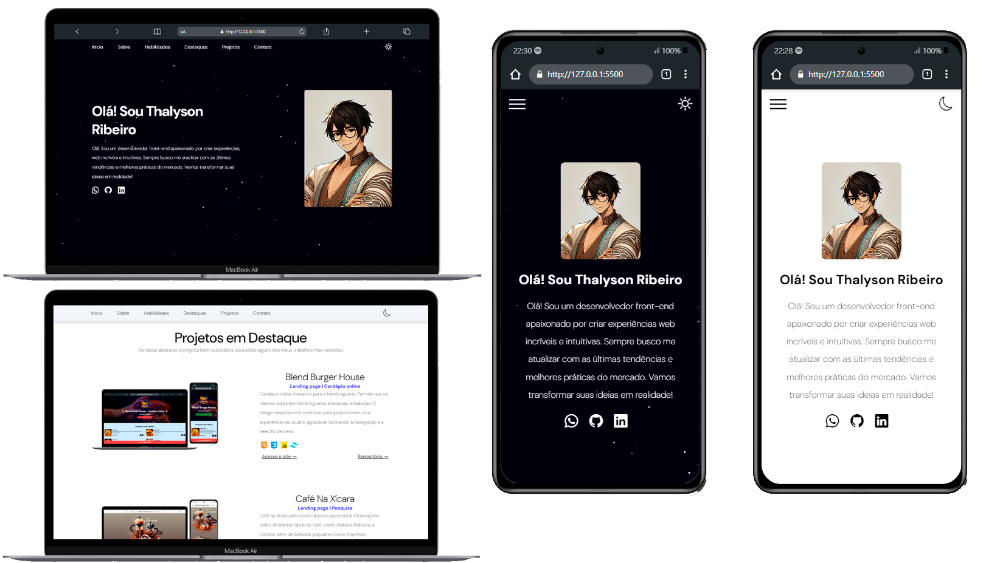

# Meu Portfólio Profissional


## 📋 Descrição

Este é meu portfólio profissional, desenvolvido para apresentar meus projetos, habilidades e experiências como desenvolvedor. O site foi criado com foco em design responsivo e performance.

## 🎯 Funcionalidades

- Página inicial com apresentação pessoal
- Seção de projetos com descrições detalhadas
- Galeria de habilidades técnicas
- Galeria de projetos
- Formulário de contato
- Design responsivo para todos os dispositivos
<!-- - Currículo para download -->

## 🛠️ Tecnologias Utilizadas

- HTML5
- CSS3
- JavaScript
  <!-- - React.js -->
  <!-- - Styled Components-->
  <!-- - Node.js (backend do formulário de contato)-->

## 📦 Como Instalar e Rodar

```bash
# Clone o repositório
git clone https://github.com/seu-usuario/portfolio

```

<!-- # Entre no diretório
cd portfolio

# Instale as dependências
npm install

# Rode o projeto
npm start-->

## 📸 Screenshots



<!-- ## 🔧 Estrutura do Projeto -->

## 📚 Seções

1. **Home** - Apresentação inicial e resumo.
2. **Sobre**, **Habilidades** - Informações detalhadas sobre minha trajetória, ecnologias e ferramentas que domino.
3. **Destaques** - Projetos em destaques.
4. **Projetos** - Página dos trabalhos realizados.
<!--4. **Habilidades** - Tecnologias e ferramentas que domino -->
5. **Contato** - Formulário e informações de contato.

## 🔍 Status do Projeto

O projeto está em constante desenvolvimento. Próximas atualizações incluirão:

- [x] Modo escuro
- [ ] Internacionalização (EN/PT)
<!-- - [ ] Blog integrado -->
- [x] Animações de transição entre seções

## 🤝 Como Contribuir

1. Faça um fork do projeto
2. Crie uma branch para sua feature (`git checkout -b feature/AmazingFeature`)
3. Commit suas mudanças (`git commit -m 'Add some AmazingFeature'`)
4. Push para a branch (`git push origin feature/AmazingFeature`)
5. Abra um Pull Request

## 📝 Licença

Este projeto está sob a licença MIT. Veja o arquivo [LICENSE](LICENSE) para mais detalhes.

## 👨‍💻 Autor

Desenvolvido por THalyson

<!-- - [GitHub](https://github.com/ThalysonRibeiro) -->
<!-- - [Portfolio](https://seuportfolio.com) -->

---

⭐ Se você gostou deste projeto, por favor, dê uma estrela!
